# CarpeDiemAI - 零代码网站生成平台


## 📖 项目简介

本项目是一个基于 **Spring Boot 3 + LangChain4j + Vue 3** 以 **AI 驱动 + 零代码** 为核心的创新平台，让用户只需用自然语言描述需求，AI 即可自动生成完整的网站，支持 **可视化编辑、一键部署、企业级管理**。

**主页**
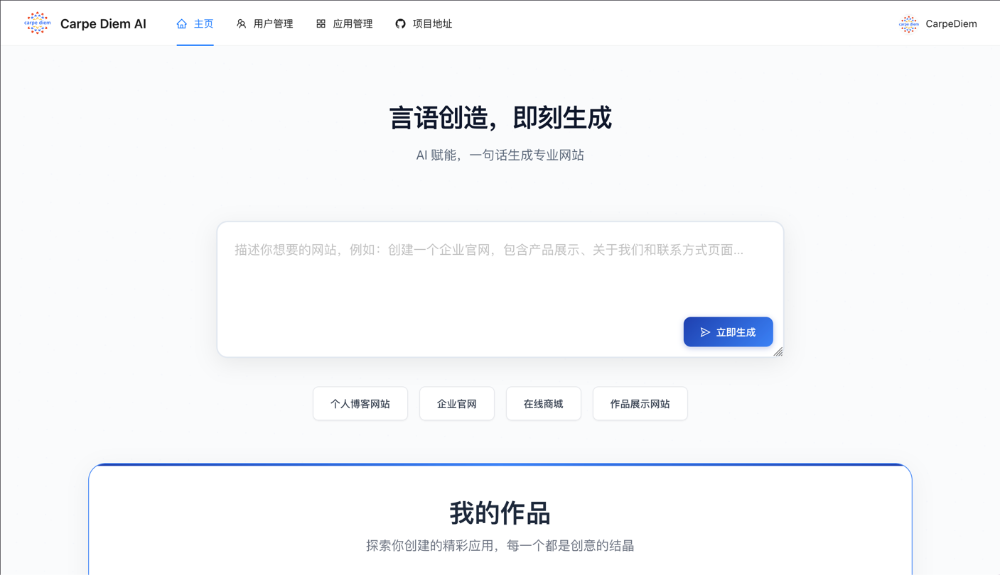

**我的作品**
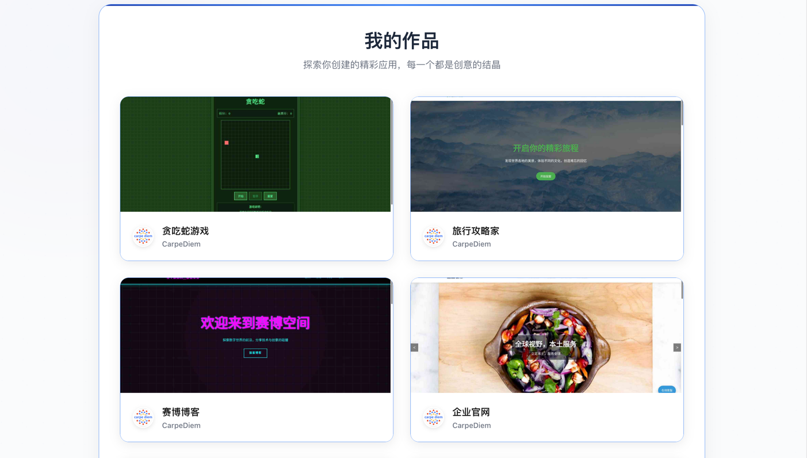

**精选推荐**
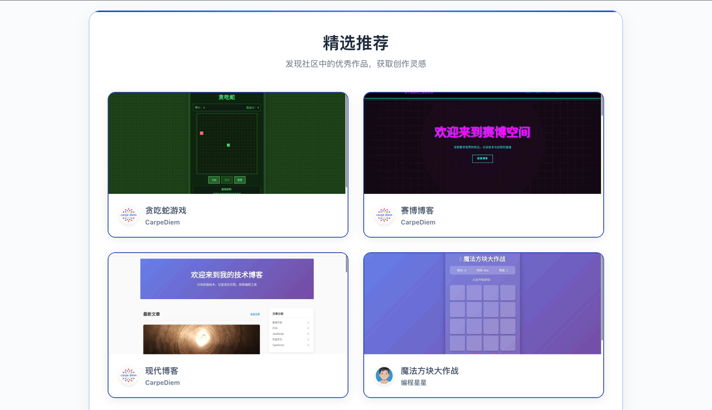

## ✨ 核心功能

### 1. 智能代码生成

- 使用自然语言描述您的网站需求，AI 自动分析并生成合适的网站结构
- 通过先进的工具调用机制生成高质量的代码文件
- 流式输出让您实时观看 AI 的执行过程和思考逻辑

【🖼️ 在此处放置代码生成演示截图】

### 2. 可视化编辑

- 生成的应用实时预览，所见即所得
- 进入编辑模式，自由选择页面元素进行修改
- 与 AI 对话快速调整页面样式和布局直到满意

**编辑**
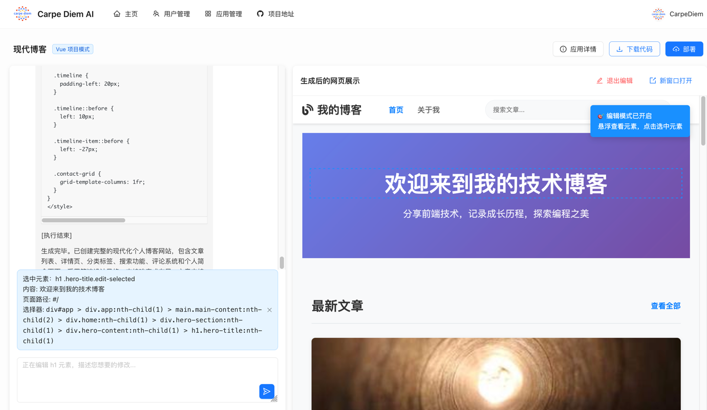

**AI 修改**
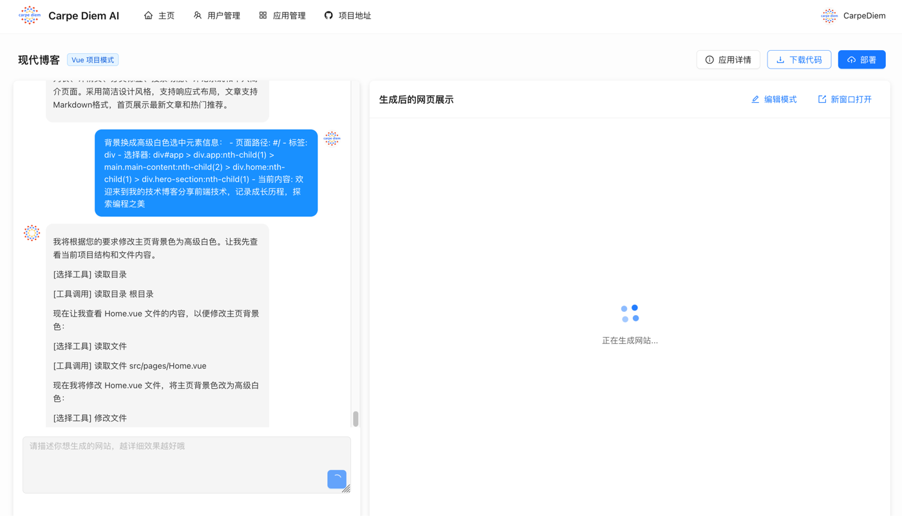

**修改完成**
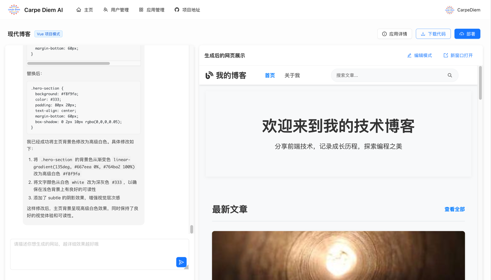

### 3. 一键部署分享

- 将生成的网站一键部署到云端服务器
- 自动生成封面图和访问地址
- 支持完整项目源码下载，便于二次开发

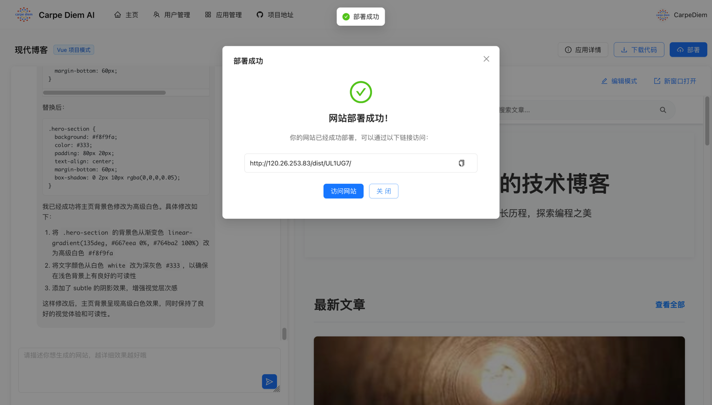

### 4. 企业级管理

- 完善的用户权限管理系统
- 应用生命周期管理
- 管理员可设置精选应用展示

**用户管理**
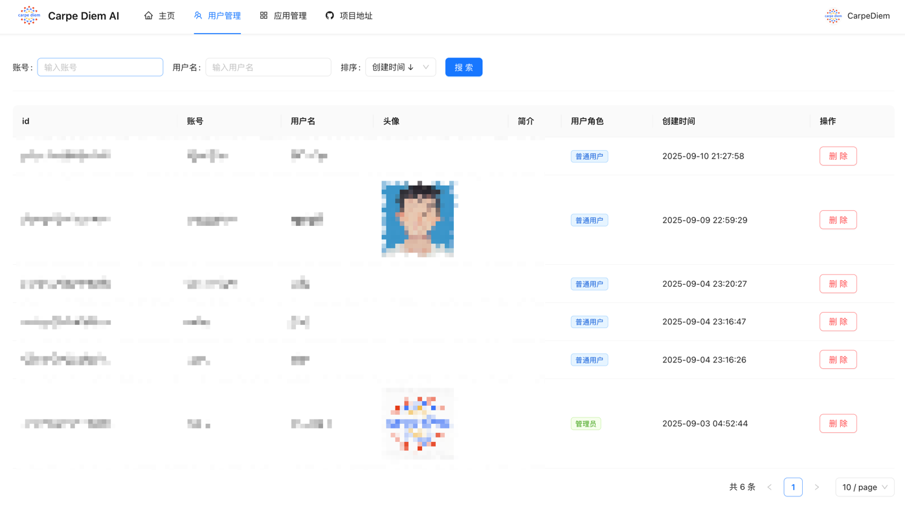

**应用管理**
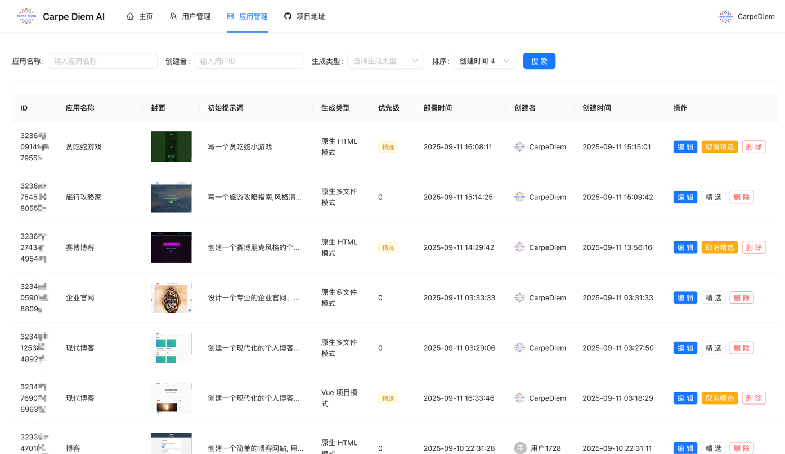

## 📈 项目监控

### 系统监控

- **健康检查**：`/actuator/health`
- **Prometheus 指标**：`/actuator/prometheus`
- **应用信息**：`/actuator/info`

### 业务监控

- AI 调用次数和成功率
- Token 消耗统计
- 用户活跃度
- 应用生成成功率

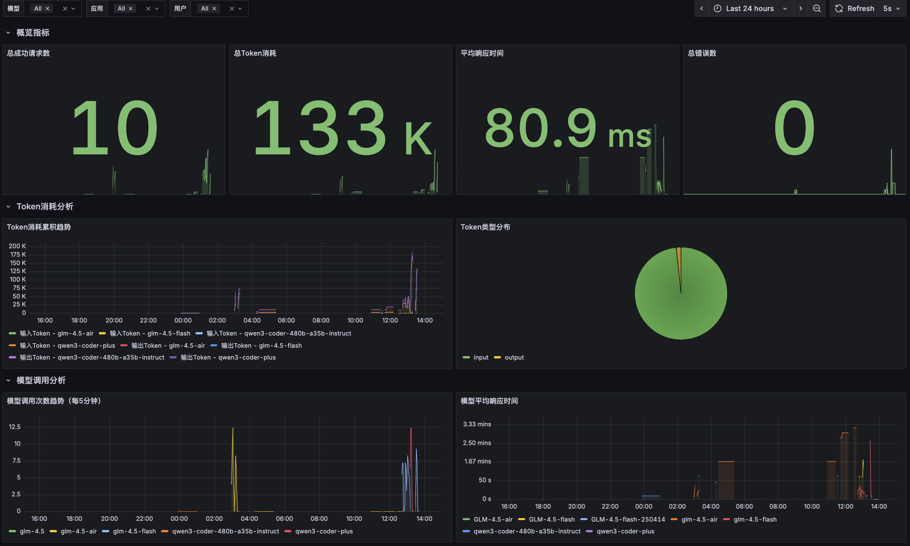

## 🏗️ 技术架构

### 后端技术栈

- **Spring Boot 3.5.4** - 企业级 Java 开发框架
- **LangChain4j 1.1.0** - AI 应用开发框架
- **LangGraph4j 1.6.0** - AI 工作流实现
- **MySQL 8.0+** - 关系型数据库
- **MyBatis-Flex 1.11.1** - ORM 框架
- **Redis + Caffeine** - 多级缓存方案
- **Prometheus + Grafana** - 监控系统

### 前端技术栈

- **Vue 3** - 渐进式 JavaScript 框架
- **TypeScript** - 类型安全的开发体验
- **Vite** - 快速构建工具
- **Element Plus** - UI 组件库

## 📊 核心业务流程
### 架构设计

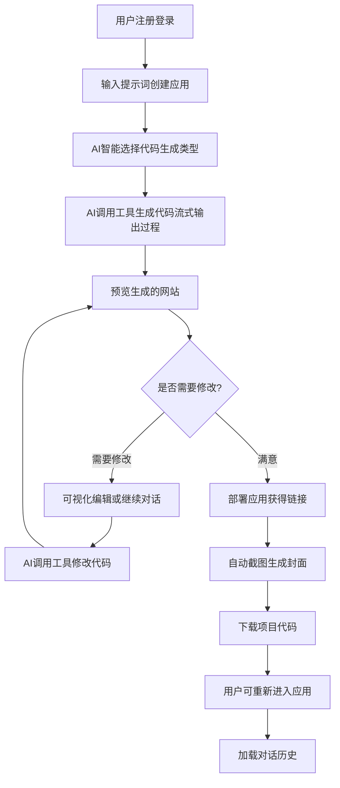

## 🚀 快速开始

### 环境要求

- JDK 17+
- Node.js 18+
- MySQL 8.0+
- Redis 6.0+

### 安装步骤

1. **克隆项目**

```bash
git clone https://github.com/CarpeWu/ai-website-generator
cd ai-website-generator
```

2. **后端启动**

```bash
# 安装依赖
./mvnw clean install

# 配置数据库
# 修改 src/main/resources/application.yml 中的数据库配置

# 启动应用
./mvnw spring-boot:run
```

3. **前端启动**

```bash
cd ai-code-mother-frontend

# 安装依赖
npm install

# 启动开发服务器
npm run dev
```

4. **访问应用**

- 前端地址: http://localhost:5173
- 后端API: http://localhost:8123


## 🔧 开发指南

### 项目结构

```
ai-code-mother/
├── src/                          # 后端源码
│   ├── main/
│   │   ├── java/                 # Java 源文件
│   │   └── resources/            # 配置文件
│   └── test/                     # 测试代码
├── ai-code-mother-frontend/       # 前端源码
│   ├── src/                      # 源代码
│   ├── public/                   # 静态资源
│   └── package.json              # 依赖配置
├── scripts/                      # 部署脚本
├── config/                       # 配置文件
└── docs/                         # 文档
```


## 🌟 为什么选择 CarpeDiemAI？

- **零代码体验**：无需编程背景，自然语言描述即可生成网站
- **AI 智能驱动**：基于大语言模型的智能分析和代码生成
- **企业级架构**：采用微服务架构，支持高并发场景
- **完整生态**：从生成到部署的一站式解决方案
- **开源免费**：MIT 协议，完全开源免费使用

## 🤝 贡献指南

我们欢迎任何形式的贡献！

1. Fork 本仓库
2. 创建特性分支 (`git checkout -b feature/AmazingFeature`)
3. 提交更改 (`git commit -m 'Add some AmazingFeature'`)
4. 推送到分支 (`git push origin feature/AmazingFeature`)
5. 打开 Pull Request

## 📞 联系我们

- 项目主页: https://github.com/CarpeWu/ai-website-generator
- 问题反馈: https://github.com/CarpeWu/ai-website-generator/issues
- 邮箱: agtg@foxmail.com

## 🙏 致谢

感谢以下开源项目和技术：

- [Spring Boot](https://spring.io/projects/spring-boot)
- [LangChain4j](https://docs.langchain4j.dev/)
- [Vue.js](https://vuejs.org/)
- [Element Plus](https://element-plus.org/)

---

⭐ 如果这个项目对您有帮助，请给我们一个 Star！